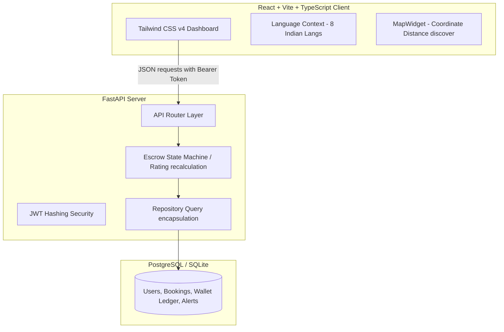

# ConstructHire - SaaS Blue-Collar Labor Marketplace MVP

ConstructHire is a location-aware, daily-wage construction labor marketplace that connects verified workers (Masons, Electricians, Plumbers, Painters, Carpenters, Helpers) with customers and contractors. 

The platform features location-aware worker discovery ranked by an AI match score, escrow wallet balance safety, mediator roster digitization, and an administrative control panel for fraud and dispute management.

---

## 🏗️ System Architecture & Workflow



### Key Business Workflows
1. **AI Match Score Ranking**: 
   $$\text{Match Score} = (\text{Rating} \times 7) + (\text{Completion Rate} \times 0.25) + \text{Online Status (25 pts)} + \text{Verified Status (15 pts)} + \text{Distance Score}$$
   Where $\text{Distance Score} = \max(0, 25 - \text{Distance} \times 3)$
2. **Escrow Safety Ledger**:
   - Customer holds contract amount in escrow (`ACCEPTED` state).
   - Upon worker completion (`COMPLETED`), 95% is credited to the worker's wallet, and 5% is recorded as platform commission.
   - If a dispute is resolved in the Customer's favor by an Admin, the funds are refunded to the customer.

---

## 📂 Project Directory Structure

```
NewCollageProject/
├── backend/
│   ├── app/
│   │   ├── core/           # Config, Database Engine, Security
│   │   ├── models/         # SQLAlchemy Schemas (Base, Users, Bookings, Wallet, Alerts)
│   │   ├── repositories/   # Data Access Layer
│   │   ├── schemas/        # Pydantic Schemas
│   │   ├── services/       # Escrow Business Logic
│   │   ├── routers/        # FastAPI Endpoints
│   │   └── main.py         # App Entry Point
│   ├── migrations/         # Alembic database migrations
│   ├── tests/              # Pytest Unit Tests
│   └── requirements.txt    # Python requirements
├── frontend/
│   ├── src/
│   │   ├── components/     # MapWidget, Header, Sidebar
│   │   ├── context/        # Auth, Language Translations
│   │   ├── pages/          # Login, Dashboard, WorkerSearch, Wallet, AdminPanel
│   │   └── services/       # Axios API client
│   ├── package.json        # Node requirements
│   └── vite.config.ts      # Vite build config
├── render.yaml             # Render Blueprint Deploy Config
├── constructhire.db        # Seeded local SQLite database
└── README.md               # Documentation (This file)
```

---

## ⚙️ Local Installation & Setup

### Prerequisites
- Python 3.14+
- Node.js 18+

### 1. Backend Setup
1. Open a terminal in the `backend/` directory.
2. Initialize virtual environment and install dependencies:
   ```bash
   python -m venv .venv
   .\.venv\Scripts\activate
   pip install -r requirements.txt --only-binary :all:
   ```
3. Run the development server (auto-seeds the local SQLite database on startup):
   ```bash
   python -m uvicorn app.main:app --host 127.0.0.1 --port 8000
   ```
4. Access Swagger API documentation at: `http://127.0.0.1:8000/docs`

### 2. Frontend Setup
1. Open a terminal in the `frontend/` directory.
2. Install npm packages:
   ```bash
   npm install
   ```
3. Run Vite dev server:
   ```bash
   npm run dev
   ```
4. Open your browser and navigate to: `http://localhost:5173/`

### 3. Run Unit Tests
To run the automated FastAPI test suite:
```bash
cd backend
.\.venv\Scripts\python.exe -m pytest tests -v
```

---

## 🔑 Demo Bypass Login Credentials

To facilitate quick testing during viva presentations:
- **Phone number**: Any 10-digit number (e.g., `9876543210`)
- **Bypass OTP**: `123456`
- Select any role (**Customer**, **Worker**, **Mediator**, **Admin**) to automatically seed and sync a session.
